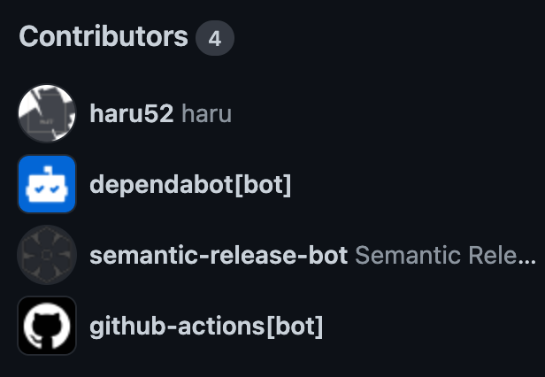

# Magic Lecture License

## 概要

## 動作要件

## 利用方法

## 詳細

## バージョニングポリシー

[セマンティック バージョニング 2.0.0](https://semver.org/lang/ja/spec/v2.0.0.html)

## ライセンス

[WTFPL](LICENSE)

## コントリビューション

[コントリビューティングガイドライン](https://haru52.github.io/magic_lecture_license/CONTRIBUTING.html)

## ドキュメント

[ドキュメント | magic_lecture_license](https://haru52.github.io/magic_lecture_license/)

## 作者

[haru](https://haru52.com/)
